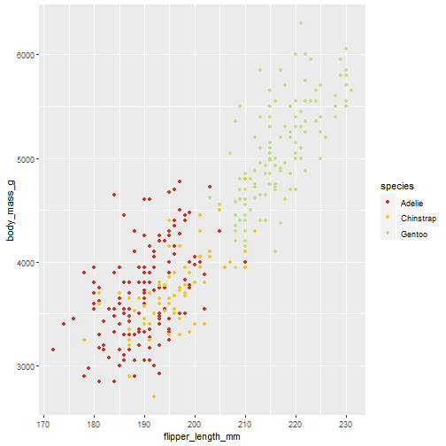
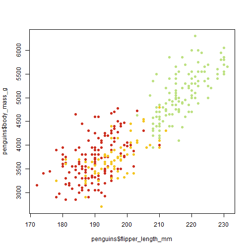

## Introduction

This package contains a selection of colour palettes inspired by the plumage of Australian birds.


## Installation

This package is hosted on GitHub and can be installed using the devtools package:


```r
devtools::install_github("shandiya/feather")
```


## How to use `feather`

Colour palettes are stored as a list called `feather_palettes`, and can be accessed thus:


```r
library(feather)
names(feather_palettes)
```

```
## [1] "pardalote"               "plains_wanderer"         "bee_eater"               "rose_crowned_fruit_dove"
## [5] "eastern_rosella"
```

`get_pal` is a function that returns the chosen palette as a vector of hex colour codes.


```r
get_pal("eastern_rosella")
```

```
## [1] "#cd3122" "#f4c623" "#bee183" "#6c905e" "#2f533c" "#b8c9dc" "#2f7ab9"
```

`print_pal` is a function that displays the colour palette in the plots pane.


```r
eastern_rosella <- get_pal("eastern_rosella")
print_pal(eastern_rosella)
```


## Examples

`ggplot`:


```r
library(palmerpenguins)
library(tidyverse)

ggplot(penguins) +
  geom_point(aes(flipper_length_mm, body_mass_g, colour = species)) +
  scale_colour_manual(values = get_pal("eastern_rosella"))
```



base `R`:


```r
library(palmerpenguins)
plot(penguins$flipper_length_mm, penguins$body_mass_g, col = get_pal("eastern_rosella")[factor(penguins$species)], pch = 19)
```




## Contribute

If you would like to contribute to this package or have suggestions for improvement, please contact [@ShandiyaB](https://twitter.com/ShandiyaB) on Twitter or submit a pull request. 


